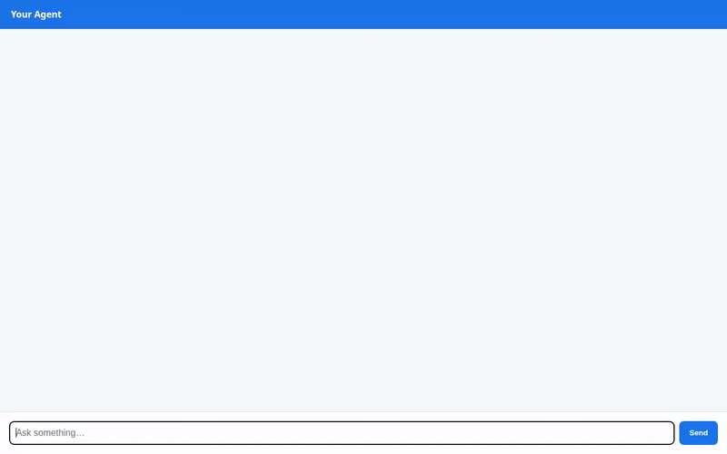

# Travel PA — AI Travel Personal Assistant Agent

Travel PA is an intelligent AI personal travel assistant built with the **Google Agent Development Kit (ADK)** and powered by **Gemini**. It helps travelers search for destinations, generate destination imagery and short videos, look up live weather and exchange rates, geocode addresses, find nearby points of interest, manage travel catalogs, and maintain long-term memory of user preferences and dietary restrictions across sessions.



---

## 🚀 Key Implemented Capabilities

Every feature below is implemented in `app/agent.py` and supported by Google Cloud services:

* **Long-Term Memory Bank (`VertexAiMemoryBankService`)**: Persists user preferences, trip context, and critical dietary/allergy restrictions across sessions so recommendations stay tailored and safe.
* **Firestore Destination Catalog (`google-cloud-firestore`)**: Search catalog items by city/category (`search_travel_spots`) and store new travel destinations dynamically (`add_travel_spot`).
* **AI Image Generation (`gemini-3.1-flash-lite-image`)**: Generates visual travel destination images, saves artifacts to ADK Playground, and uploads directly to public Cloud Storage buckets (`generate_spot_image`).
* **AI Video Generation (`gemini-omni-flash-preview`)**: Streams short destination video generation via Google's Omni model, saving video artifacts and uploading to public Cloud Storage buckets (`generate_spot_video`).
* **Google Maps Location Services**:
  * **Address Geocoding**: Resolves addresses and landmarks into exact lat/long coordinates using Google Maps Geocoding API (`geocode_address`).
  * **Nearby Places Search**: Discovers nearby restaurants, museums, parks, and attractions using Google Places API (`find_nearby_places`).
* **Real-Time Live Weather (`Open-Meteo API`)**: Fetches current temperature, humidity, and wind conditions for any city worldwide (`get_live_weather`).
* **Currency Exchange (`Frankfurter API`)**: Converts monetary amounts between international currency codes using real-time rates (`convert_currency`).
* **Time Zone Lookup**: Retrieves current local times across worldwide time zones (`get_current_time`).
* **Sandboxed Code Execution (`AgentEngineSandboxCodeExecutor`)**: Runs python code dynamically inside isolated execution sandboxes.
* **Generative A2UI Rich Cards (`a2ui`)**: Generates structured, responsive UI surfaces (`Card`, `Column`, `Row`, `Text`, `Image`) rendered directly in the user interface.

---

## 📂 Project Structure

```
travel-pa/
├── app/
│   ├── agent.py               # Main agent logic, tools, memory, and A2UI callbacks
│   ├── a2ui_utils.py          # A2UI response formatting helper
│   ├── fast_api_app.py        # Local FastAPI proxy server for agent interaction
│   └── app_utils/             # Core app utilities and helpers
├── frontend/                  # Lightweight FastAPI proxy and plain web chat interface
├── tests/                     # Unit, integration, and evaluation tests
├── agent_demo.gif             # Recorded demo animation of the agent interface
├── agents-cli-manifest.yaml   # Manifest declaring deployment metadata and runtime config
├── GEMINI.md                  # Development guide and context for Antigravity AI assistant
└── pyproject.toml             # Python dependencies managed via uv
```

---

## 🛠️ Prerequisites

Before running the project locally:

1. **Python 3.10+** and **uv** package manager ([Installation Guide](https://docs.astral.sh/uv/getting-started/installation/))
2. **Google Cloud SDK** (`gcloud`) logged in with access to your GCP project:
   ```bash
   gcloud auth login
   gcloud auth application-default login
   gcloud config set project <YOUR_PROJECT_ID>
   ```
3. **Environment Variables**: Set required keys (e.g. `GOOGLE_MAPS_API_KEY`) in `.env` or export them in your shell environment:
   ```bash
   export GOOGLE_MAPS_API_KEY="<your-google-maps-api-key>"
   ```

---

## 💻 Local Setup & Running Instructions

### 1. Install Dependencies
```bash
uv sync
```

### 2. Test in Local Playground
Run the interactive ADK developer playground:
```bash
uv run agents-cli playground
```

### 3. Run Local Frontend Chat UI Server
Start the frontend web application locally:
```bash
cd frontend
uv run python main.py
```
Open your browser to the local server address printed in the terminal console.

---

## ☁️ Deployment

Deploy the agent logic to **Agent Engine / Agent Runtime**:
```bash
agents-cli deploy
```

Deploy the frontend service to **Cloud Run**:
```bash
gcloud run deploy travel-pa-frontend \
  --source=./frontend \
  --region=us-east1 \
  --allow-unauthenticated \
  --set-env-vars AGENT_ENGINE_RESOURCE_NAME="<YOUR_DEPLOYED_RESOURCE_NAME>",AGENT_DIRECTORY="app"
```

---

## 📄 License

This project is licensed under the Apache 2.0 License.
